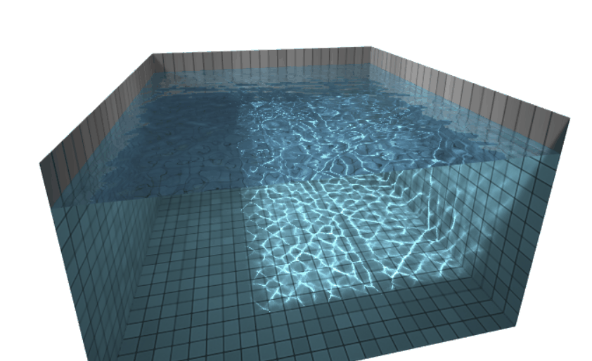

# threejs-water

> 日本語のREADMEはこちらです: [README.ja.md](README.ja.md)

A real-time water simulation for Three.js, implementing reflections, refractions, and interactive caustics. This project is a port of Evan Wallace's foundational [webgl-water](http://madebyevan.com/webgl-water) demo.

**Live Demo: [https://martinrenou.github.io/threejs-water](https://martinrenou.github.io/threejs-water)**





## Features

-   **Real-time Water Simulation:** A shader-based physics simulation updates water height and velocity each frame.
-   **Dynamic Caustics:** Realistic caustics are generated by calculating light refraction through the water surface.
-   **Interactive Ripples:** Disturb the water surface with your mouse to create ripples.
-   **High-Quality Rendering:** The water surface features reflections from a skybox and refractions of the pool below, blended with a Fresnel term.
-   **Modular Codebase:** The logic is cleanly separated into classes for the simulation (`WaterSimulation`), caustics (`Caustics`), water surface (`Water`), and pool (`Pool`).

## How It Works

The effect is achieved through a multi-pass rendering pipeline:

1.  **Water Simulation:** The simulation runs entirely on the GPU. Two render targets are used in a ping-pong fashion to store the water's height and velocity. A GLSL shader calculates wave propagation based on the previous state, allowing ripples to spread and fade realistically.
2.  **Caustics Generation:** The water surface mesh is projected onto the pool floor from the light source's perspective. The vertex shader refracts the light rays based on the water's normal vectors (derived from the simulation texture). The resulting concentration of light is rendered into a caustics texture.
3.  **Final Scene Rendering:**
    -   The pool geometry is rendered first. Its shader samples the tile texture and applies the generated caustics texture, creating the bright patterns on the pool floor.
    -   The water surface (a tessellated `PlaneGeometry`) is rendered next. Its vertex shader displaces vertices vertically using the simulation texture. The fragment shader calculates reflections and refractions to render the final, transparent water effect.

## Setup and Usage

This project uses a specific version of Three.js (r113) and its corresponding `TrackballControls`, which are included via a CDN in `index.html`.

To run this project locally:

1.  Clone the repository:
    ```bash
    git clone https://github.com/martinrenou/threejs-water.git
    ```
2.  Navigate to the project directory:
    ```bash
    cd threejs-water
    ```
3.  Start a local web server. A common way is using Python:
    ```bash
    python -m http.server
    ```
4.  Open your web browser and go to `http://localhost:8000`.

The main class `WaterSim` orchestrates the simulation. You can